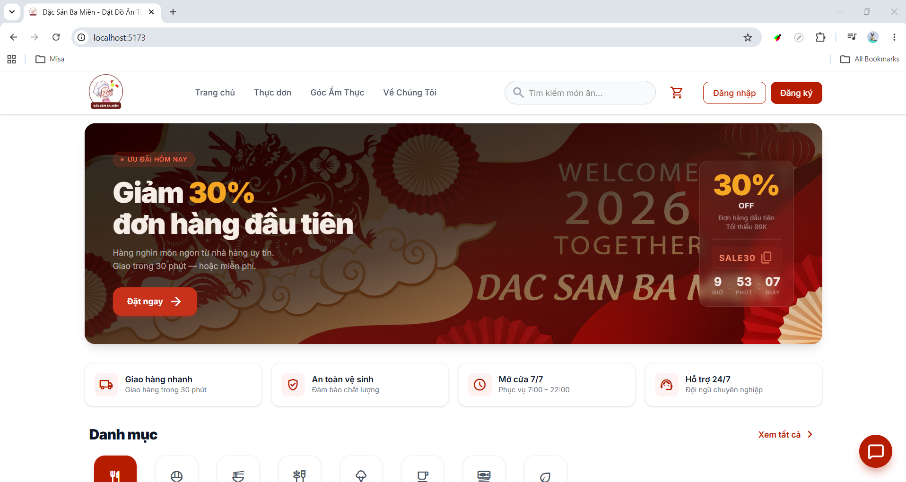
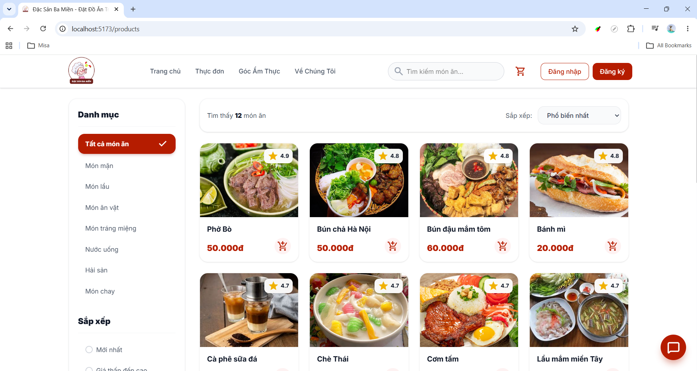
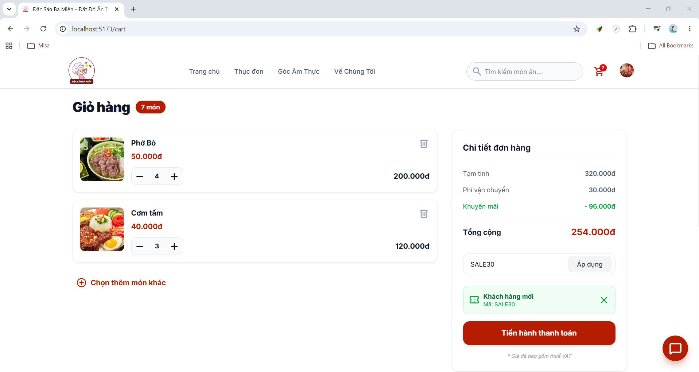
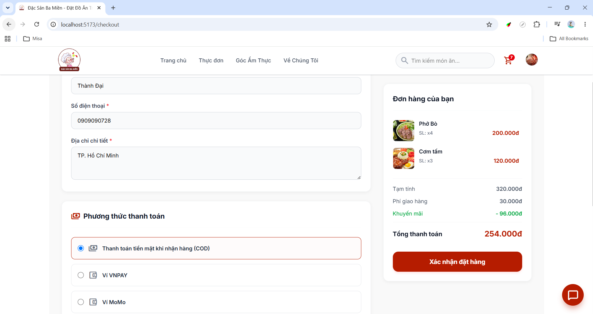
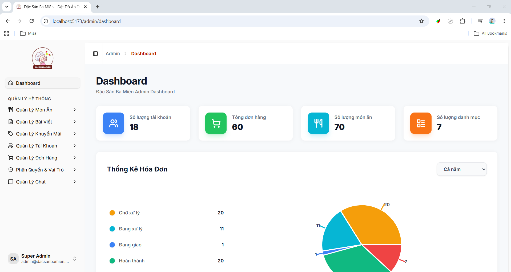
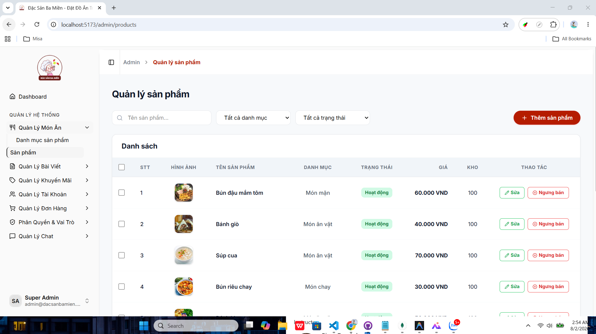
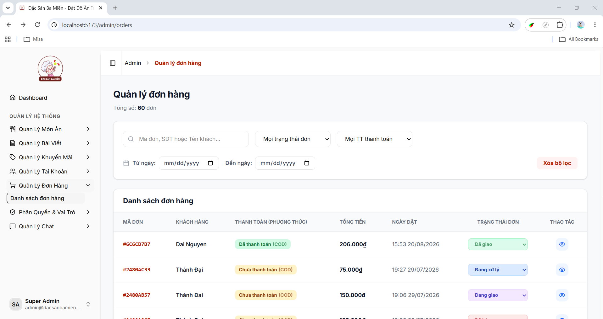

# 🍜 Dac San Ba Mien

**A fullstack food ordering platform featuring Vietnamese cuisine from three regions, built with React, Node.js, MongoDB, and AI-powered customer support.**

## 🚀 Features

### 🌟 Core Functionalities

- **Product Browsing & Search:** Browse menu with pagination, filter by category/price/rating, search by product name
- **Shopping Cart Management:** Add/update/remove items with stock validation and automatic total calculation
- **Order Processing:** Place orders with delivery info, apply promotion codes, track status (Pending → Processing → Shipped → Delivered)
- **Payment Integration:** COD, VNPAY, and MOMO with secure transaction handling
- **Product Reviews:** Rate (1-5 stars) and review products after delivery
- **Blog & Articles:** Food-related articles organized by category

### 🤖 AI Customer Support

- Real-time customer support powered by Google Gemini AI
- Product consultation and FAQ assistance
- Seamless escalation to human agents when needed
- Customer Support Hub: list conversations, reply, close / return to bot

### 🔐 User Authentication

- JWT authentication (access token 15 min + refresh token 14 days)
- Secure session with HTTP-only cookies
- Google OAuth integration
- Password recovery via OTP (email-based verification)
- Profile management with avatar upload

### ⚙️ Admin Features

- **Dashboard Analytics:** Revenue overview, order statistics, user metrics with interactive charts (Recharts)
- **Product & Category Management:** CRUD operations, multi-image upload, soft delete, hierarchical categories, search & pagination
- **Order & Promotion Management:** Update order status, search/filter orders; create discount codes (percentage/fixed) with conditions, usage limits, and validity periods
- **Blog Management:** CRUD blog posts with rich text editor (TinyMCE) and thumbnail upload
- **User & Role Management:** View/manage users, activate/deactivate accounts; create custom roles with granular permissions (format: `module_action`, e.g. `products_view`, `orders_edit`)
- **Chat Management:** Monitor conversations, join chats, respond to customers in real-time, close conversations

## 🛠️ Tech Stack

- **Frontend**: React 19 + TypeScript + Vite 7 + React Router v7 + Zustand + Tailwind CSS 4 + shadcn/ui
- **Backend**: Node.js + Express.js + Socket.IO
- **Database**: MongoDB (Mongoose ODM)
- **Authentication**: JWT + HTTP-only Cookies + Google OAuth
- **AI Chatbot**: Google Gemini AI
- **Payment Gateway**: VNPAY + MOMO
- **Email Service**: Nodemailer (OTP Verification)
- **Media Storage**: Cloudinary
- **Additional Tools**: React Hook Form + Zod, Recharts, TinyMCE, Axios, Framer Motion, Sonner, SweetAlert2, Swiper

## 🌐 Getting Started

### Prerequisites

- Node.js >= 18.x
- MongoDB >= 6.x
- npm or yarn

### Installation

#### 1. Clone the repository

```bash
git clone https://github.com/ThanhDai2005/dac-san-ba-mien.git
cd dac-san-ba-mien
```

#### 2. Configure Environment Variables

Create `.env` in backend:

```env
# Server
PORT=3000

# Database
MONGO_URL=mongodb://localhost:27017/dac_san_ba_mien

# JWT Secrets
ACCESS_TOKEN_SECRET=your_access_token_secret_key_here
REFRESH_TOKEN_SECRET=your_refresh_token_secret_key_here

# Client URL (CORS)
CLIENT_URL=http://localhost:5173

# Cloudinary (Image Upload)
CLOUD_NAME=your_cloudinary_cloud_name
CLOUD_KEY=your_cloudinary_api_key
CLOUD_SECRET=your_cloudinary_api_secret

# Email (Nodemailer - Gmail)
EMAIL_USER=your_email@gmail.com
EMAIL_PASS=your_gmail_app_password

# Google OAuth
GOOGLE_CLIENT_ID=your_google_client_id
GOOGLE_CLIENT_SECRET=your_google_client_secret

# Google Gemini AI (Chatbot)
GEMINI_API_KEY=your_gemini_api_key

# VNPAY
VNPAY_TMN_CODE=your_vnpay_tmn_code
VNPAY_HASH_SECRET=your_vnpay_hash_secret
VNPAY_URL=https://sandbox.vnpayment.vn/paymentv2/vpcpay.html
VNPAY_RETURN_URL=http://localhost:5173/payment/vnpay-return

# MOMO
MOMO_PARTNER_CODE=your_momo_partner_code
MOMO_ACCESS_KEY=your_momo_access_key
MOMO_SECRET_KEY=your_momo_secret_key
MOMO_ENDPOINT=https://test-payment.momo.vn/v2/gateway/api/create
MOMO_REDIRECT_URL=http://localhost:5173/payment/momo-return
MOMO_IPN_URL=http://localhost:3000/api/v1/payment/momo-ipn
```

Create `.env` in frontend:

```env
# API Base URL
VITE_API_URL=http://localhost:3000/api/v1

# Socket.IO URL
VITE_SOCKET_URL=http://localhost:3000

# Google OAuth Client ID
VITE_GOOGLE_CLIENT_ID=your_google_client_id

# TinyMCE API Key (Rich Text Editor)
VITE_TINYMCE_API_KEY=your_tinymce_api_key
```

#### 3. Setup Backend

```bash
cd backend
npm install
npm run dev
```

#### 4. Setup Frontend

```bash
cd frontend
npm install
npm run dev
```

## 📸 Screenshots

### 1. Homepage



### 2. Product Listing



### 3. Shopping Cart



### 4. Checkout



### 5. Admin Dashboard



### 6. Product Management



### 7. Order Management



## 🤝 Contributing

Contributions are welcome! Feel free to fork and submit a pull request.

## 💌 Contact

- **Developer:** [ThanhDai2005](mailto:Dai2272005nv@gmail.com)
- **GitHub:** [GitHub Profile](https://github.com/ThanhDai2005)
